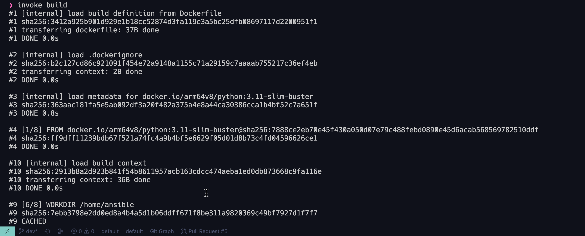
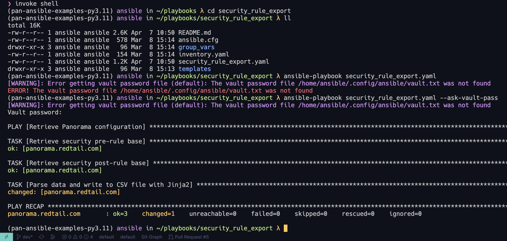
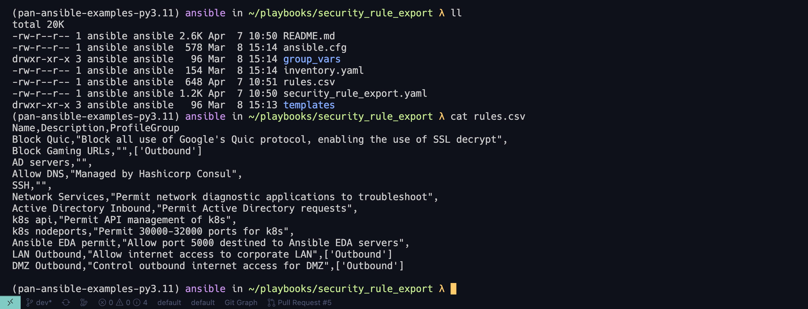

# security_rule_export 🚀

This project retrieves a list of security rules from Panorama and their associated Security Profile Groups (if any) and exports the data to a CSV file.

## Table of Contents 📚

- [security\_rule\_export 🚀](#security_rule_export-)
  - [Table of Contents 📚](#table-of-contents-)
  - [Overview 🌐](#overview-)
  - [Execution ⚙️](#execution-️)
    - [Build and Enter the Container 🖥️](#build-and-enter-the-container-️)
    - [Screenshots 📷](#screenshots-)
  - [Technical Deep Dive 🔎](#technical-deep-dive-)

## Overview 🌐

This project retrieves a list of security rules from Panorama and their associated Security Profile Groups (if any) and exports the data to a CSV file.

This playbook is expected to be ran within the project's Docker container image, but could be executed locally if you feel comfortable setting the environment; the Dockerfile and `tasks.py` file can be used to provide guidance on steps required.

## Execution ⚙️

### Build and Enter the Container 🖥️

If you have not already done so, please follow the steps below to build and enter the container.

1. Install [Invoke](https://www.pyinvoke.org/):

    This will be a one-time installation on your local machine and is required to build and enter the container

    ```bash
    pip install invoke
    ```

2. Use Invoke's "build" function found within `tasks.py` file to build the container:

    ```bash
    invoke build
    ```

3. Use Invoke's "shell" function found within `tasks.py` file to enter the container:

    ```bash
    invoke shell
    ```

4. Once inside the container, you can change the directory to a playbook of your choice and run the playbook:

    ```bash
    cd security_rule_export
    ansible-playbook security_rule_export.yml --ask-vault-pass
    ```

### Screenshots 📷





## Technical Deep Dive 🔎

The security_rule_export project leverages a Dockerfile to create a container with the necessary libraries and tools installed. The Dockerfile includes the following steps:

1. Install the required dependencies for PAN-OS SDK, Poetry, and Ansible.

2. Set up the user environment and install the Python packages.

3. Configure the shell with Oh My Zsh and activate the Poetry virtual environment upon entering the container.

For more details, please refer to the comments within the `Dockerfile` and `tasks.py` files.
